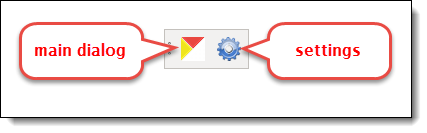
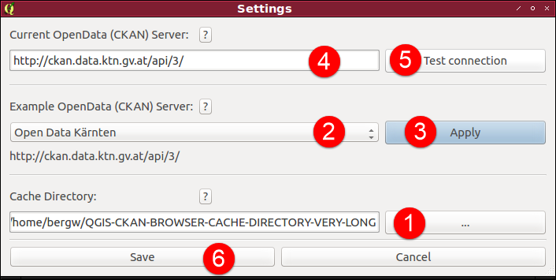
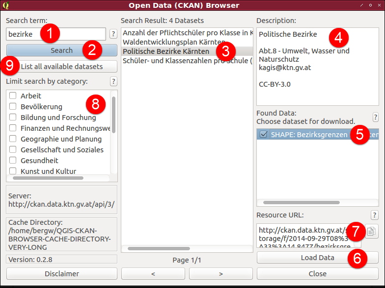

QGIS CKAN-Browser
=============

QGIS PlugIn to load and display Open Data from CKAN enabled data portals.


Sponsored by [Amt der Kärntner Landesregierung - KAGIS](http://www.kagis.ktn.gv.at)


__DISCLAMER__

_This plugin has been tested with various CKAN servers (**API v3 supported only**), but we soon came to realize that each data portal implements its very own strategy for structuring the metadata._

_It is very likely that data from some servers cannot be browsed or downloaded!_

_Pull requests that make such servers accessible (and don't break others) are welcome._

## Install

#### Within QGIS

`Plugins -> Manage and Install Plugins -> Search: CKAN-Browser -> Install plugin`

#### From Zip

Download [CKANBrowser.zip](https://github.com/BergWerkGIS/QGIS-CKAN-Browser/blob/master/CKANBrowser.zip) and extract to `~/.qgis2/python/plugins`

#### From Source

```
git clone https://github.com/BergWerkGIS/QGIS-CKAN-Browser.git
cd QGIS-CKAN-Browser/CKAN-Browser
make clean
make derase
make deploy
```

## Use

After successful install there is a new toolbar available (click on `Settings`):



#### Settings

1. Select a local directory where downloaded data will be cached
2. Choose a pre-configured CKAN Server
3. `Apply` to copy selected CKAN Server URL to `4.`
4. Leave URL as is or enter your own
5. Check if connection is possible
6. `Save` settings and close




#### Open Data (CKAN) Browser

1. Enter your search term and press `<ENTER>` or click on `2`
2. Search: query server with search term
3. List of data sets found, click to get more details in `4`, `5` and `7`
4. Description of selected data set (if supported by server)
5. Resources associated with selected data set (if supported by server)
  1. Click on resource to see resource URL `7` and copy to clipboard in case automatic download does not work
  2. Check resource (or several, if supported by server) to select for download
6. `Load Data` to download the selected resources and automatically open them
7. Download URL of selected resource. Handy to copy and try the link in a browser if the download does not work, e.g.: some resources link to HTML or 404 pages
8. List of categories/groups available at the selected CKAN server (if supported by server)
  1. Check to limit your search to one or several group(s).
  2. Double click on a group to get all data sets associated with that group
9. List all data available sets


