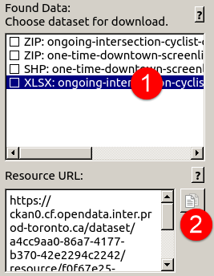
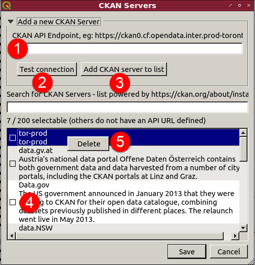

QGIS CKAN-Browser
=============

QGIS PlugIn to load and display Open Data from CKAN enabled data portals.

Sponsors:
* v0.4: [City of Toronto](https://open.toronto.ca/)
* v0.2.8 -> v0.3.0: [Amt der Kärntner Landesregierung - KAGIS](http://www.kagis.ktn.gv.at)

[Change log](CKAN-Browser/metadata.txt)

__DISCLAMER__

_This plugin has been tested with various CKAN servers (**API v3 supported only**), but each and everyone has its own quirks which might result in failed downloads._

The plugin queries the provided CKAN server, parse its response and tries to download resources according to the links provided in the response.
If the provided metadata contains invalid links the plugin of course fails to download the selected resources.

**Before opening an issue about a failed download please try to download the failing resource with a browser.**
If the download works in the browser then it might be a bug in the plugin.

1. Click on the resource
2. Click to copy resource link
3. Paste into browser and check if download works



Bonus points for including log messages in the issue:
`CKAN Browser Settings -> Miscellaneous -> Check "Show debug information in the 'Log Messages' panel"`

## Install

#### Within QGIS

`Plugins -> Manage and Install Plugins -> All -> Search: CKAN-Browser -> Install plugin`

#### From Zip

* Download [CKANBrowser.zip](https://github.com/BergWerkGIS/QGIS-CKAN-Browser/blob/master/CKANBrowser.zip)
* `QGIS -> Manage and Install Plugins -> Install from ZIP`
* Select downloaded file `...`
* `Install Plugin`

#### From Source

```
git clone https://github.com/BergWerkGIS/QGIS-CKAN-Browser.git
cd QGIS-CKAN-Browser/CKAN-Browser
make clean
make derase
make deploy
```

## Use

After successful install there is a new toolbar available (click on `Settings`):


#### Settings

1. Select a local directory where downloaded data will be cached
2. Edit authentication settings if necessary
3. Check debug messages - only necessary when reporting bugs
4. `Save` settings and close


#### Open CKAN Browser

1. Select the CKAN Server to use (see below)
2. Enter your search term and press `<ENTER>` or click on `3`
3. Search: query server with search term
4. List of data sets found, click to get more details in `5`, `6` and `7`
5. Description of selected data set (**if provided by server**)
6. Resources associated with selected data set (**if supported by server**)
6.1. Click on resource to see resource URL `7` and copy to clipboard in case automatic download does not work
6.2. Check the box of the resource (or several, **if supported by server**) to select for download
7. Resource url and copy url button if the resource cannot be downloaded (eg link to webpage or an unsupported file format)
8. `Load Data` to download the selected resources and automatically open them
9. List all data available sets
10. List of categories/groups available on the selected CKAN server (**if supported by server**)
10.1. Check to limit your search to one or several group(s).
10.2. Double click on a group to get all data sets associated with that group


#### Add Custom CKAN Server Instance

The list of available CKAN server intances gets prepopulated on every start from https://ckan.org/about/instances/ but is limited to those which provide an API URL.

Custom CKAN server instances can be added manually as well.

1. Enter the CKAN endpoint, including trailing `v3/`
2. Test the connection
3. If the connection succeeded, name the instance and add it to the list
4. To select an instance for use check the box
5. Custom instances are marked by a blue background.
5.1. Right click on a custom instance brings up the `Delete` context menu to remove the instance from the list. **Only custom instances can be deleted.**


